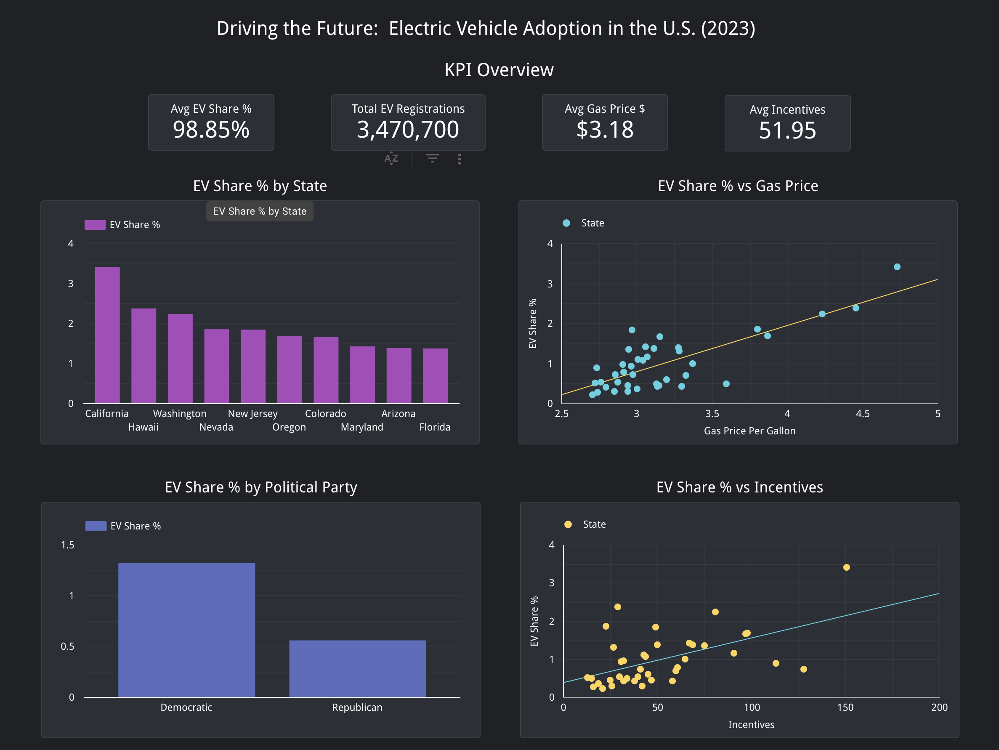

# U.S. Electric Vehicle (EV) Adoption Dashboard & Predictive Modeling

This project explores U.S. electric vehicle (EV) adoption trends using 2023 data. It includes a machine learning model to simulate the impact of policy and market shifts (e.g., gas price spikes or incentive boosts), with interactive visualizations delivered in a Looker Studio dashboard.

---

## Table of Contents

- [Dashboard Preview](#-dashboard-preview)
- [Dataset Overview](#-dataset-overview)
- [Data Preprocessing](#-data-preprocessing)
- [Exploratory Data Analysis](#-exploratory-data-analysis)
- [Predictive Modeling](#-predictive-modeling)
- [Simulation Scenarios](#-simulation-scenarios)
- [Looker Studio Dashboard](#-looker-studio-dashboard)
- [Key Insights](#-key-insights)
- [Technologies Used](#-technologies-used)
- [Project Structure](#-project-structure)
- [Author & License](#-author--license)

---

## Dashboard Preview

> 

---

## Dataset Overview

- **Source**: Aggregated 2023 EV registration, infrastructure, and policy data by U.S. state  
- **Rows**: 50 (one per U.S. state)  
- **Fields**:
  - EV share (%), total vehicles, charging stations
  - Gasoline and electricity prices
  - Policy incentives, income, education, party affiliation

---

## Data Preprocessing

- Cleaned and standardized state names  
- Calculated `chargers_per_1000_evs` and `ev_share_%`  
- Merged multiple sources: infrastructure, economic, political, and behavioral
- Exported final dashboard-ready CSV with simulation outputs

---

## Exploratory Data Analysis

Visualized trends and correlations in EV adoption across the U.S.:

- Higher EV share in **Democratic** and **coastal** states  
- Strong correlation between **gasoline price** and EV adoption  
- Weak or inverse correlation between **charger density** and EV share  
- Income and education levels showed moderate positive relationships

---

## Predictive Modeling

### Final Model: Linear Regression

- **R² Score**: 0.86  
- **RMSE**: 0.1746

### Features Used:
- Incentives  
- Gasoline price  
- Electricity price  
- Per capita income  
- Charger density

### Coefficients:
- `gasoline_price_per_gallon`: **+0.80**  
- `incentives`: **+0.004**  
- `chargers_per_1000_evs`: **-0.007** (inverse)

---

## Simulation Scenarios

Using the regression model, we simulated EV share under three conditions:

### Gas Prices Spike to $6
- Most states nearly **double** their EV share
- Strongest effect in Republican states with low current adoption

### Incentives Increase by 50%
- Modest but meaningful increases in EV share
- Strongest effect in lower-income and mid-adoption states

### Combined (Gas = $6 + Incentives +50%)
- Largest jump: Iowa from **0.29% → 2.86%**  
- States with low current share show **>2% gains**

---

## Looker Studio Dashboard

> [View Dashboard](https://lookerstudio.google.com/reporting/9f9c6faa-95b9-4939-b8e4-cf541b8a3759)

### Sections:
- National KPIs: Avg EV Share, Gas Price, Incentives
- Bar charts: EV share by state (actual and simulated)
- Scatter plots: Adoption vs. price, income, education
- Filters: Party, income range, gas price range

### Interactivity:
- Scenario comparison (actual vs simulated)
- State-level filtering
- Percent and value formatting for precision

---

## Key Insights

- **Policy incentives** alone have limited impact — price pressure (like gas spikes) is more influential  
- Political affiliation is a strong non-economic predictor  
- Simulations show the potential for **3–5x adoption growth** under targeted conditions  
- Highest gains occur in currently underserved or conservative states

---

## Technologies Used

- Python (pandas, seaborn, scikit-learn, matplotlib)
- Jupyter Notebook
- Google Looker Studio
- Linear Regression, Random Forest
- Git & GitHub

---

## Project Structure

ev_adoption_project/ 
├── data/ 
│ └── EV_Data.csv 
├── notebooks/ 
│ └── ev_analysis_and_simulation.ipynb 
├── outputs/ 
│ └── ev_dashboard_final.csv 
├── dashboard/ 
│ └── looker_dashboard_link.txt 
└── README.md 

---

## Author & License

**Author**: Matt Baglietto  
matt.baglietto11@gmail.com  
[LinkedIn](https://www.linkedin.com/in/matthewbaglietto)

Licensed under the [MIT License](LICENSE)
